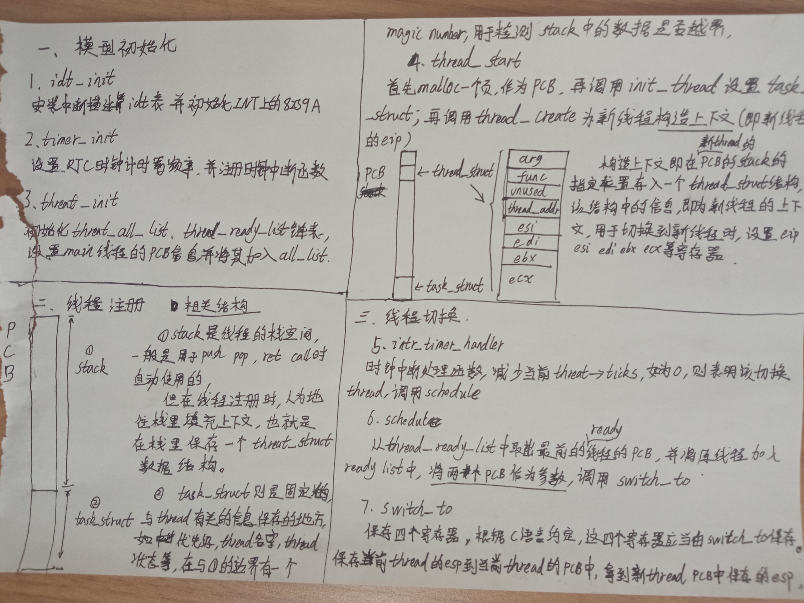

# os_kernel
**a kernel for study**
  
  
src:  
.../demo:some instances to display and test c language feature.  
.../build:store obj files.  
...makefile:organize total project-files and make them. 
  
  
reference:《操作系统真象还原》、《从实模式到保护模式》

**线程模型**  
  
  
**文件系统模型**

